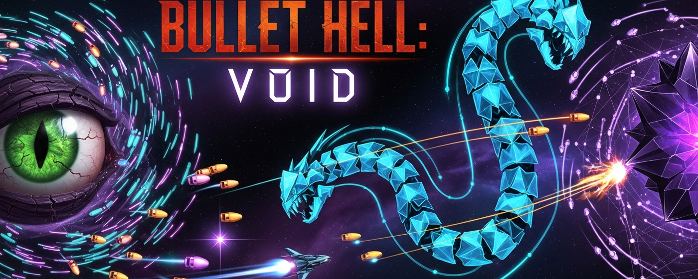

# Bullet Hell:Void
Dodge insane bullet patterns from 3 cosmic void bosses. Tiny hitbox, huge spectacle. Each boss has unique attack phases.

🔮 BULLET HELL: VOID

Face the cosmos. Survive the impossible.

Bullet Hell: Void is an intense arcade shoot-em-up (shmup) built right into your Chrome browser. Pilot a nimble spaceship through cascading waves of neon bullets fired by three epic cosmic bosses — each with multiple unique attack phases that escalate to pure chaos.

✦ FEATURES

• 3 Unique Void Bosses — The Watcher, Null Serpent, and the Void Core. Each boss has 3-4 distinct attack phases with escalating difficulty.
• Insane Bullet Patterns — Ring bursts, spirals, aimed salvos, laser beams, cross-patterns, wave formations, and rotating walls of doom.
• Tiny Hitbox System — Your ship's true hitbox is just a few pixels wide. Hold SHIFT to enter Focus Mode and see your exact hitbox.
• Procedural Soundtrack — Atmospheric synthwave music generated for each boss battle, with full sound effects.
• Audio Toggle — Instant sound on/off switch, no hassle.
• Score System with Grazing — Fly dangerously close to bullets for bonus graze points.
• Bombs — Screen-clearing special attacks for when things get too intense.
• Power-Up System — Collect items dropped by bosses to upgrade your firepower.
• Particle Effects & Screen Shake — Every hit, every explosion, every phase transition is visually spectacular.
• No internet required — Runs 100% offline in your browser.

✦ CONTROLS

WASD / Arrow Keys — Move
Z or Space         — Shoot
X or Escape        — Bomb (screen clear)
Shift              — Focus Mode (slow + hitbox visible)

✦ HOW TO PLAY

Click the extension icon to open the game. Press Z or Space to start. Destroy each boss to progress to the next. Collect power items to increase firepower. Use bombs wisely when surrounded. Surviving is an art — every bullet tells a story.

✦ MORE GAMES

Find all my browser games at: https://web-gam-dev.blogspot.com
